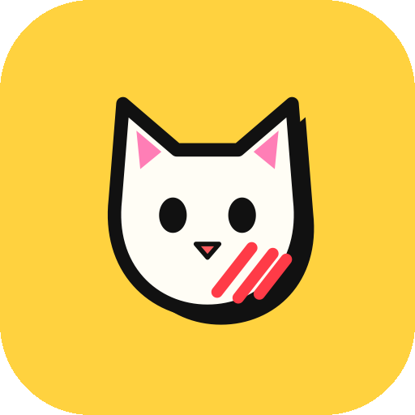

<p align="center"></p>

# MeowClaw

MeowClaw is an open-source Android agent that operates your phone for you. It's a native Kotlin + Jetpack Compose app. Quick actions and chat run on-device, and it controls other apps through a virtual mouse and keyboard.

## How it works

```
request ──► Needle 3 (on-device, ~30 ms) ──► quick action (open app, call, SMS, alarm, timer, volume…)
               │ multi-step / unsure
               ▼
        Fast path ──► taps named elements, types searches — no model call
               │ anything else
               ▼
        Brain: on-device LLM (Cactus) or any OpenAI-compatible API
               │
               ▼
        Screen loop: read screen (+ screenshot for vision models) → pick one step → act → repeat
```

- **Needle 3 (Cactus Compute).** A 35 MB tool-calling model. It turns simple requests into device actions offline, in tens of milliseconds. Its results are checked against your words: timer durations and alarm times are re-read from the request, and "open X" must really say "open X".
- **Fast path.** Goals like *"open settings then open display"* or *"open chrome and search for weather in london"* run deterministically. The agent taps the named element or types into the search box without a model call.
- **Brain.** For chat and open-ended tasks, pick one:
  - **On-device** via the Cactus engine:
    - Gemma 4 E2B: vision, tools, audio
    - Qwen3.5 0.8B / 2B: vision, tools
    - LFM2.5 350M / 1.2B: tools
    - LFM2.5-VL 1.6B, LFM2-VL 450M: vision
    - FunctionGemma 270M
  - **API:** any OpenAI-compatible endpoint (DeepSeek, OpenRouter, Groq, NVIDIA NIM, Ollama, llama.cpp / LM Studio on your LAN).
- **Vision.** Vision models receive a screenshot each step. The agent's own overlay is hidden while it's captured.
- **Native tool calling.** On-device tool models answer with constrained function calls, so small models stay on the rails.

## Virtual mouse & keyboard

The agent's "hands" try the best available backend for every action:

| | Accessibility (default) | Input method | ADB via Shizuku |
|---|---|---|---|
| Tap, double tap, long press, drag, wheel-scroll | dispatched gestures | — | `input tap/swipe/draganddrop` |
| Type text | `ACTION_SET_TEXT` | Android 13+ accessibility IME, or the optional **MeowClaw Keyboard** | `input text` |
| Keys & shortcuts (Enter, Tab, arrows, Ctrl+A…) | IME editor action | real key events | `input keyevent / keycombination` |

While the agent is in control, a **cursor** glides to each target with a click ripple and an action label, and the **screen edge glows**. Both are drawn in a touch-transparent accessibility overlay, so no "display over other apps" permission is needed.

## Features

- Chat and Agent modes, voice input, spoken replies, chat history
- Skill memory: successful step sequences replay without the model
- Task history with full traces and token counts
- Telegram remote control. The first chat to message the bot becomes its only owner.
- Neubrutalist UI in light and dark themes
- Private by default: Cactus cloud telemetry and handoff are compiled out; keys stay on the device

## Install

Download the latest APK from the [Releases page](https://github.com/farzanshibu/meowclaw/releases). Use `app-universal-release.apk`, or `app-arm64-v8a-release.apk` on modern phones.

- Needs Android 8.0 (API 26) or newer.
- On-device LLMs (Cactus) need a 64-bit ARM phone.
- Needle also runs on 32-bit ARM.

## Setup

1. Install the APK and open MeowClaw.
2. **Hands:** enable **MeowClaw Screen Control** in Accessibility settings.
   - If Android shows *"Restricted setting"*, open **Settings → Apps → MeowClaw → ⋮ → Allow restricted settings** first.
3. **Brain:** download **Needle** (35 MB). Then either:
   - download an on-device model (Gemma 4 E2B or Qwen3.5 2B for multi-step tasks), or
   - add an API key. For free cloud use: OpenRouter + `openai/gpt-oss-120b:free`.
4. Optional:
   - **Shizuku** for ADB-level fallbacks
   - **Modify system settings** for brightness control

## Build

Requirements: JDK 17, Android SDK with NDK and CMake, git.

```sh
./gradlew :app:assembleDebug            # builds Needle JNI + both Cactus runtimes
./gradlew :app:assembleDebug -PskipCactus  # faster, without on-device LLM runtimes
./gradlew :app:testDebugUnitTest
./gradlew :app:assembleRelease -PsplitAbi  # universal + per-ABI APKs
```

- **Needle engine:** the prebuilt static library is downloaded from Hugging Face at a pinned revision and SHA-256-verified.
- **Cactus runtimes:** `scripts/build-cactus.sh` compiles v2.2.2 and v1.14 from pinned commits.
- **Model weights:** downloaded in-app from Hugging Face, pinned and checksummed.

## Credits

- Started as a fork of [PrivateAgent](https://github.com/orailnoor/private-agent) by orailnoor and techjarves (Flutter), since rewritten natively in Kotlin
- [Needle 3](https://huggingface.co/Cactus-Compute/needle3) and the [Cactus engine](https://github.com/cactus-compute/cactus) by Cactus Compute (Apache-2.0)
- Model weights from Google (Gemma, FunctionGemma), Alibaba (Qwen) and Liquid AI (LFM), packaged by Cactus Compute

## License

This project is open-source and available for modification.
